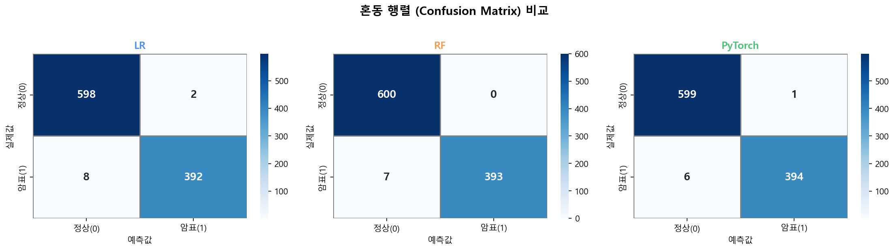
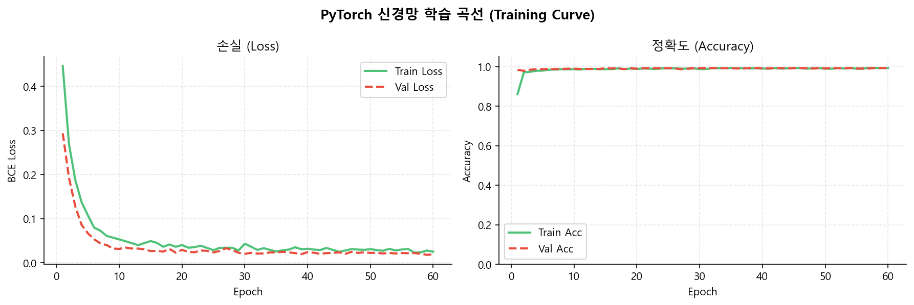
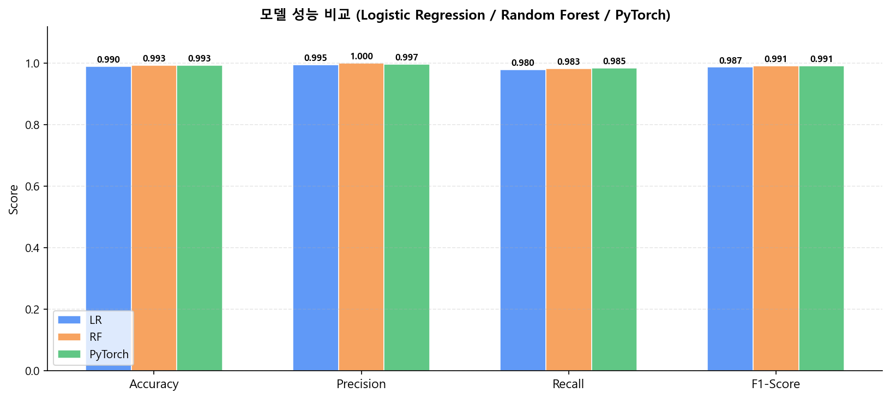
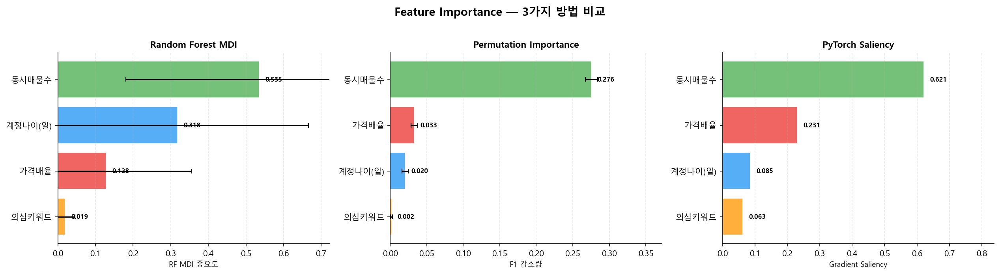

# 🎫 ScalpGuard — 티켓 암표 탐지 AI

> **대학 기계학습 과제** | AI를 활용한 사회 문제 개선 프로젝트  
> PyTorch 신경망 + Streamlit 웹앱으로 티켓 암표(부정 재판매)를 자동 탐지하고  
> 의심 거래를 신고할 수 있는 시스템을 구축합니다.

---

## 목차

1. [프로젝트 개요](#1-프로젝트-개요)
2. [합성 데이터 설계](#2-합성-데이터-설계)
3. [모델 비교 — 베이스라인 vs 신경망](#3-모델-비교--베이스라인-vs-신경망)
4. [Feature Importance 분석](#4-feature-importance-분석)
5. [신고 시스템 구조](#5-신고-시스템-구조)
6. [실행 방법](#6-실행-방법)
7. [파일 구조](#7-파일-구조)
8. [한계와 개선 방향](#8-한계와-개선-방향)

---

## 1. 프로젝트 개요

### 배경 및 동기

티켓 암표(scalping)는 공연·스포츠 티켓을 정가보다 훨씬 비싸게 되파는 부정 거래입니다.  
팬들의 정당한 관람 기회를 빼앗고 이를 금전적으로 착취하는 구조적 문제이며,  
현재 단속·신고 체계만으로는 실시간 탐지가 어렵습니다.

### 해결 방법

| 단계 | 내용 |
|------|------|
| **데이터** | 공개 데이터셋 부재 → 도메인 지식 기반 합성 데이터 5,000건 생성 |
| **모델** | Logistic Regression / Random Forest / PyTorch 신경망 3가지 비교 |
| **서비스** | Streamlit 웹앱으로 실시간 탐지 + SQLite 신고 DB + 정부 신고처 연계 |

---

## 2. 합성 데이터 설계

### 특징(Feature) 정의

공개 데이터셋이 존재하지 않으므로, 암표 거래의 도메인 특성을 반영한 합성 데이터를 생성했습니다.

| 특징 | 설명 | 단위 |
|------|------|------|
| `face_price` | 공식 정가 | 원 (10,000 ~ 150,000) |
| `sell_price` | 실제 판매가 | 원 |
| `price_ratio` | 가격배율 = sell_price / face_price | 배 |
| `account_age_days` | 판매자 계정 나이 | 일 |
| `num_listings` | 판매자의 동시 매물 수 | 개 |
| `suspicious_keywords` | 설명글 의심 키워드 포함 여부 | 0 / 1 |

### 클래스별 특성 분포

| 특징 | 정상 (label=0) | 암표 (label=1) |
|------|---------------|---------------|
| `price_ratio` | 0.85 ~ 1.15배 (평균 **1.055**) | 1.5 ~ 5.0배 (평균 **3.018**) |
| `account_age_days` | 180 ~ 3000일 (평균 **1,471**) | 1 ~ 90일 (평균 **113**) |
| `num_listings` | 1 ~ 4개 (평균 **2.5**) | 5 ~ 30개 (평균 **17.5**) |
| `suspicious_keywords` | 0 확률 **80%** | 1 확률 **90%** |

### 클래스 비율 및 노이즈 처리

- **전체 5,000건**: 정상 3,000건 (60%) / 암표 2,000건 (40%)
- **경계 노이즈**: 정상 5%, 암표 5%를 서로 반대 클래스처럼 변형 → 모델이 경계 케이스도 학습

```
정상 거래 (label=0)        암표 거래 (label=1)
─────────────────         ─────────────────
낮은 가격배율              높은 가격배율
오래된 계정                신규 계정
소수 매물                  다수 매물
키워드 없음(80%)           키워드 있음(90%)
        ↕ overlap noise (5%)
```

---

## 3. 모델 비교 — 베이스라인 vs 신경망

### 학습 설정

- **Train / Test 분할**: 80% / 20% (stratified)
- **전처리**: StandardScaler (평균 0, 분산 1 정규화)
- **사용 특징**: `price_ratio`, `account_age_days`, `num_listings`, `suspicious_keywords`

### PyTorch 신경망 구조

```
입력층 (4)
  ↓
Dense(32) → BatchNorm → ReLU → Dropout(0.3)
  ↓
Dense(16) → BatchNorm → ReLU → Dropout(0.3)
  ↓
Dense(1) → Sigmoid → 암표 확률
```

- **Optimizer**: Adam (lr=0.001, weight_decay=1e-4)
- **Loss**: Binary Cross Entropy
- **Scheduler**: StepLR (step=20, gamma=0.5)
- **Epochs**: 60 / Batch size: 64

### 성능 비교 결과

| 모델 | Accuracy | Precision | Recall | F1-Score |
|------|:--------:|:---------:|:------:|:--------:|
| Logistic Regression | 99.00% | 99.49% | 98.00% | 98.74% |
| **Random Forest** | **99.30%** | **100.00%** | 98.25% | **99.12%** |
| **PyTorch 신경망** | **99.30%** | 99.75% | **98.50%** | **99.12%** |

> **RF vs PyTorch**: RF는 Precision 100%로 오탐 0건, PyTorch는 Recall이 더 높아 암표를 더 많이 잡아냅니다.  
> 암표 탐지는 **놓치는 것(False Negative)이 더 위험**하므로, Recall이 높은 **PyTorch 신경망을 최종 서비스 모델로 채택**했습니다.

### 혼동 행렬



### 학습 곡선 (PyTorch)

| Epoch | Train Loss | Val Loss | Train Acc | Val Acc |
|-------|-----------|----------|-----------|---------|
| 10 | 0.0528 | 0.0312 | 98.68% | 99.00% |
| 30 | 0.0431 | 0.0201 | 98.82% | 99.30% |
| 60 | 0.0250 | 0.0188 | 99.28% | 99.30% |



### 모델 성능 비교



---

## 4. Feature Importance 분석

3가지 방법으로 특징 중요도를 측정했습니다.

| 특징 | RF MDI | Permutation | PyTorch Saliency | **순위** |
|------|:------:|:-----------:|:----------------:|:-------:|
| 동시매물수 | 0.5348 | 0.2755 | 0.6401 | **1위** |
| 계정나이(일) | 0.3180 | 0.0203 | 0.0856 | **2위** |
| 가격배율 | 0.1283 | 0.0330 | 0.2123 | **3위** |
| 의심키워드 | 0.0188 | 0.0018 | 0.0620 | **4위** |

### 분석 결과 해석

- **동시매물수 (1위)**: 암표 판매자는 한 번에 다수 티켓을 대량 매수 후 재판매하는 패턴이 가장 뚜렷함
- **계정나이 (2위)**: 신규 계정이 암표 판매에 집중적으로 악용됨 — 계정 생성 후 단기간 집중 활동
- **가격배율 (3위)**: 정가 대비 높은 가격이 암표의 본질적 특성이나, 다른 특징과 결합 시 더 강력
- **의심키워드 (4위)**: 단독으로는 약하지만 다른 특징과 결합하면 신호로 작동

### 종합 Feature Importance 비교



---

## 5. 신고 시스템 구조

### 전체 흐름

```
사용자 입력
(정가 / 판매가 / 계정나이 / 매물수 / 설명글)
        ↓
   전처리 · 키워드 탐지
        ↓
  PyTorch 모델 추론
        ↓
   위험 점수 (0~100%)
        ↓
  ┌─────────┬──────────────┐
  │ < 70%   │    ≥ 70%     │
  │  정상   │  암표 의심   │
  └─────────┴──────────────┘
                 ↓
       근거 항목별 표시
  (가격배율 / 계정나이 / 매물수 / 키워드)
                 ↓
       신고 내용 확인 · 복사
                 ↓
       ┌─────────────────────┐
       │ 앱 내 신고 접수     │  → reports.db (SQLite)
       │ 정부 신고처 안내    │  → culture.go.kr/singo
       └─────────────────────┘
```

### 신고 DB 스키마 (`reports.db`)

```sql
CREATE TABLE reports (
    id               INTEGER PRIMARY KEY AUTOINCREMENT,
    reported_at      TEXT,       -- 신고 시각
    face_price       INTEGER,    -- 정가
    sell_price       INTEGER,    -- 판매가
    price_ratio      REAL,       -- 가격배율
    account_age_days INTEGER,    -- 계정 나이
    num_listings     INTEGER,    -- 동시 매물 수
    has_keywords     INTEGER,    -- 의심 키워드 여부
    risk_score       REAL,       -- AI 위험 점수
    description      TEXT,       -- 판매 설명글
    reasons          TEXT        -- 의심 근거 요약
);
```

### UI 구성

| 화면 | 기능 |
|------|------|
| **탐지 화면** | 거래 정보 입력 → 위험 점수 게이지 + 항목별 근거 태그 표시 |
| **신고 섹션** | 70% 이상 시 활성화 / 근거 확인 / DB 저장 / 정부 신고처 링크 |
| **신고 내역** | 누적 신고 통계 카드 + 전체 목록 테이블 + CSV 다운로드 |

> ⚠️ **AI 판단의 한계**: 앱 내 모든 신고 화면에 *"최종 판단은 사람이 합니다"* 문구를 명시합니다.

---

## 6. 실행 방법

### 환경 설정

```bash
# 패키지 설치
pip install -r requirements.txt
```

### 단계별 실행

```bash
# 1단계: 합성 데이터 생성 (ticket_data.csv)
python generate_data.py

# 2단계: 모델 학습 (model.pth, scaler.pkl, results/*.png)
python train_models.py

# 3단계: Feature Importance 분석 (results/*.png)
python feature_importance.py

# 4단계: 웹앱 실행
streamlit run app.py
```

브라우저에서 **http://localhost:8501** 접속

---

## 7. 파일 구조

```
새 폴더/
│
├── generate_data.py          # 합성 데이터 생성기
├── train_models.py           # LR / RF / PyTorch 모델 학습
├── feature_importance.py     # 특징 중요도 분석 (3가지 방법)
├── app.py                    # Streamlit 웹앱
├── requirements.txt          # 의존성 패키지 목록
│
├── ticket_data.csv           # 생성된 합성 데이터 (5,000건)
├── model.pth                 # 학습된 PyTorch 모델 가중치
├── scaler.pkl                # StandardScaler (추론 시 사용)
├── reports.db                # 신고 내역 SQLite DB (자동 생성)
│
└── results/
    ├── confusion_matrices.png          # 3모델 혼동행렬 비교
    ├── metrics_comparison.png          # 정확도·정밀도·재현율·F1 비교
    ├── training_curve.png              # PyTorch 학습 곡선
    ├── feature_importance_rf_mdi.png   # RF MDI 중요도
    ├── feature_importance_permutation.png  # Permutation 중요도
    ├── feature_importance_pytorch.png  # PyTorch Saliency
    └── feature_importance_combined.png # 3가지 방법 종합 비교
```

---

## 8. 한계와 개선 방향

### 현재 한계

| 한계 | 설명 |
|------|------|
| **합성 데이터 의존** | 실제 암표 거래 데이터 없이 도메인 가정으로 생성 — 실제 분포와 차이 가능 |
| **특징 단순성** | 4개 정형 특징만 사용 — 실제에는 판매자 평점, 거래 이력, 텍스트 의미 등 다양한 신호 존재 |
| **키워드 방식의 한계** | 단순 키워드 매칭 → 우회 표현 (띄어쓰기 변형, 외래어 등) 탐지 불가 |
| **단방향 신고** | 앱 내 DB 저장만 가능, 실제 수사기관·플랫폼과 연동 없음 |
| **실시간성 부재** | 사용자가 수동 입력 — 플랫폼 API 연동 시 자동 스캔 가능 |

### 개선 방향

```
단기 개선
├── 텍스트 임베딩 (BERT/KoBERT) → 설명글 의미 분석
├── 판매자 행동 패턴 (시간대별 활동, 계정 변경 이력)
└── 앙상블: RF + PyTorch 결합으로 정밀도↑

중장기 개선
├── 실제 중고거래 플랫폼 크롤링 데이터 확보 및 레이블링
├── 플랫폼 API 연동 → 실시간 자동 탐지
├── 문화체육관광부 신고 API 연동 → 원클릭 공식 신고
└── 설명 가능한 AI (XAI): SHAP 적용으로 근거 신뢰도 향상
```

---

## 참고 자료

- 문화체육관광부 암표 신고 누리집: https://www.culture.go.kr/singo
- PyTorch 공식 문서: https://pytorch.org/docs/stable/
- scikit-learn 공식 문서: https://scikit-learn.org/stable/

---

*본 프로젝트는 대학 기계학습 수업 과제로 제작되었습니다.*  
*AI 판정 결과는 참고용이며, 모든 신고의 최종 판단은 사람이 내립니다.*
